# SM Share (👷🔧️WIP👷⛏)


[](https://github.com/jerryOkafor/SMShare/actions/workflows/Build.yml)
[](https://codecov.io/gh/jerryOkafor/SMShare)

[](#)
[](#)


SMShare is a Kotlin Multiplatform project targeting Android, iOS, Web, Desktop. The UI of SMSahre is
written completely in Jetpack Compose and shareed accross iOS, Android and Desktop.

* `/composeApp` is for code that will be shared across your Compose Multiplatform applications.
* `/iosApp` contains iOS applications.
* `/core` - Contains the core components of the codebase as shown below:
    * `/common` - App Common code [WIP]
    * `/config` - App Config [WIP]
    * `/datbase` - Database integration using `Room` + `SQLite`
    * `/datastore`  - Datastore int`gration using `Jetpack Datastore` and `kotinx.serialization`
    * `/doomain` Contains the usecases [WIP]
    * `/model` - UI models / domain models used in the app
    * `/network` - Network integreation using `ktor` and `kotlin.serialization`
    * `/rpc` - RPC integration using `kotlinx.rpc` [WIP]

## Sample

Android, iOS and Desktop screenshot sample
<p align="center">
  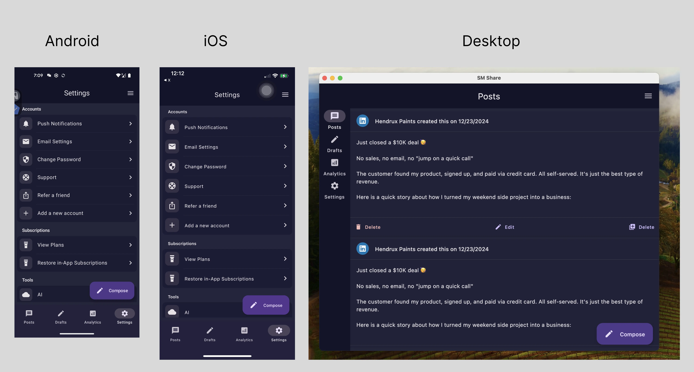
</p>

### More samples

<details>
  <summary>Android</summary>
<p align="center">
  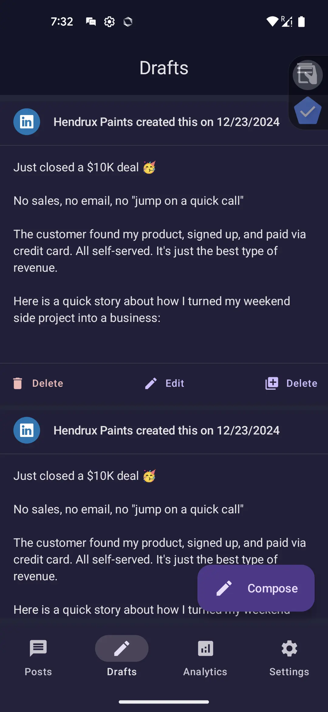
  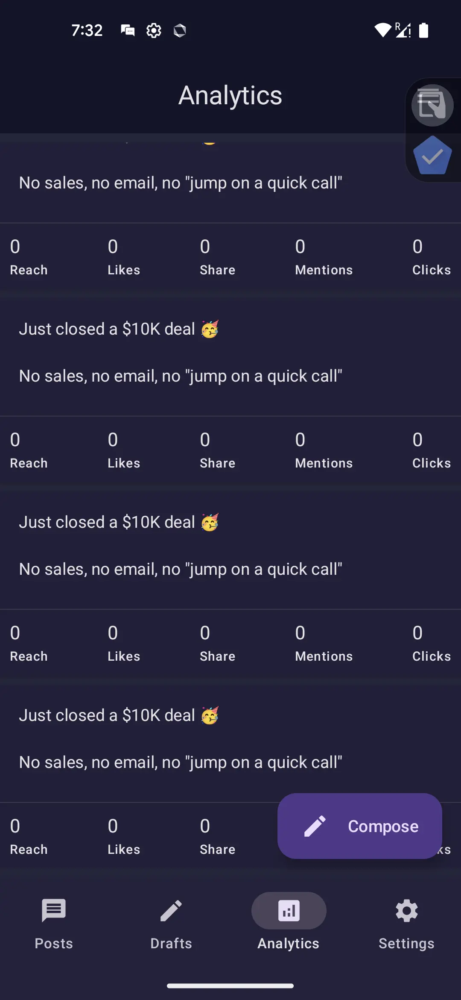
  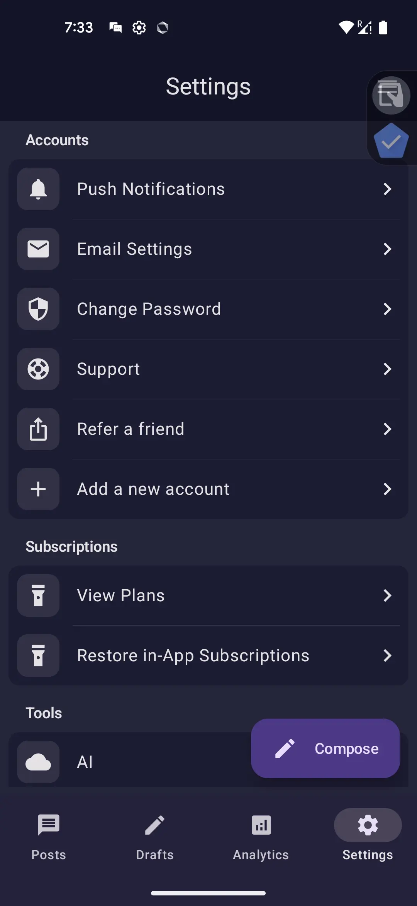
  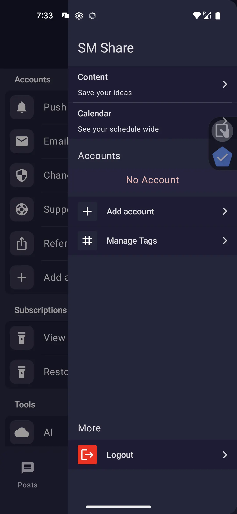
  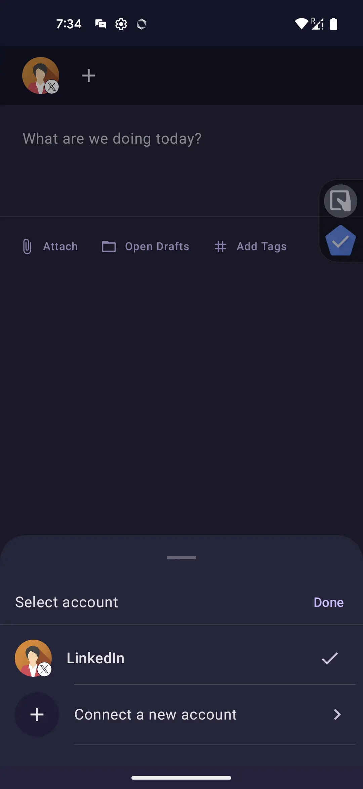
</p>
</details>

<details>
  <summary>iOS</summary>
<p align="center">
  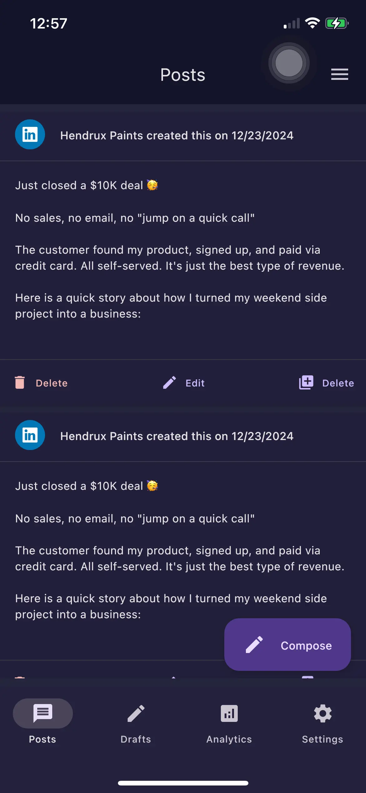
  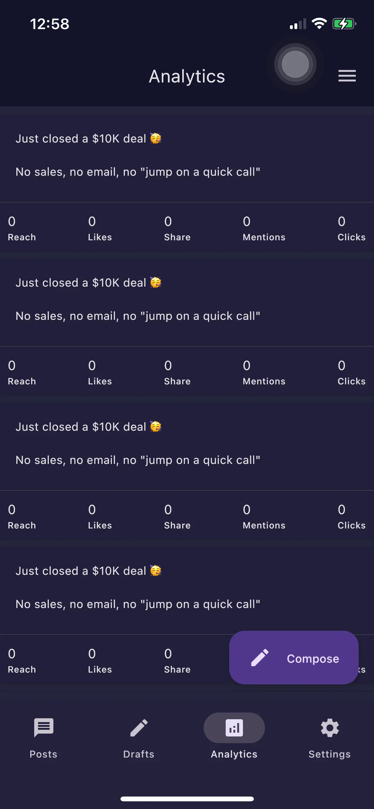
  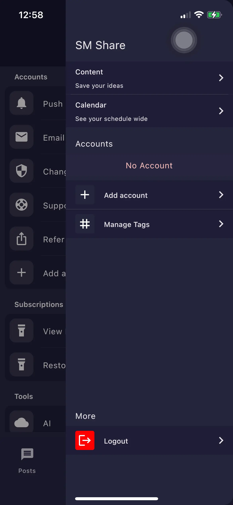
  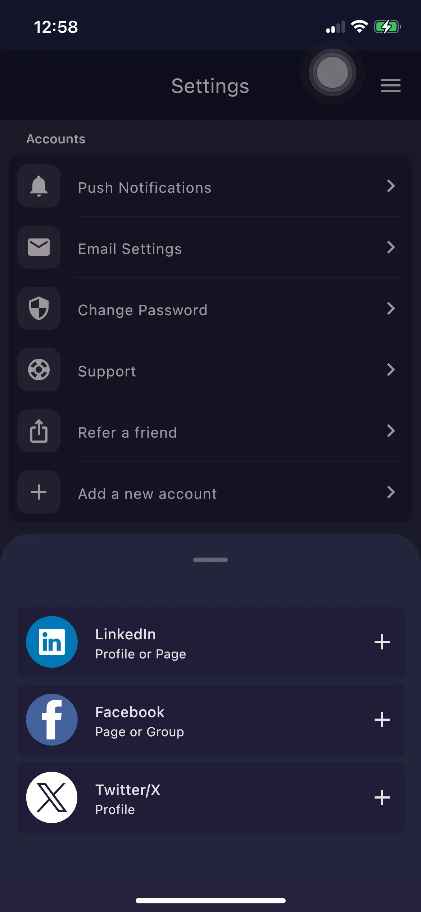
</p>
</details>

<details>
  <summary>Desktop</summary>
<p align="center">
  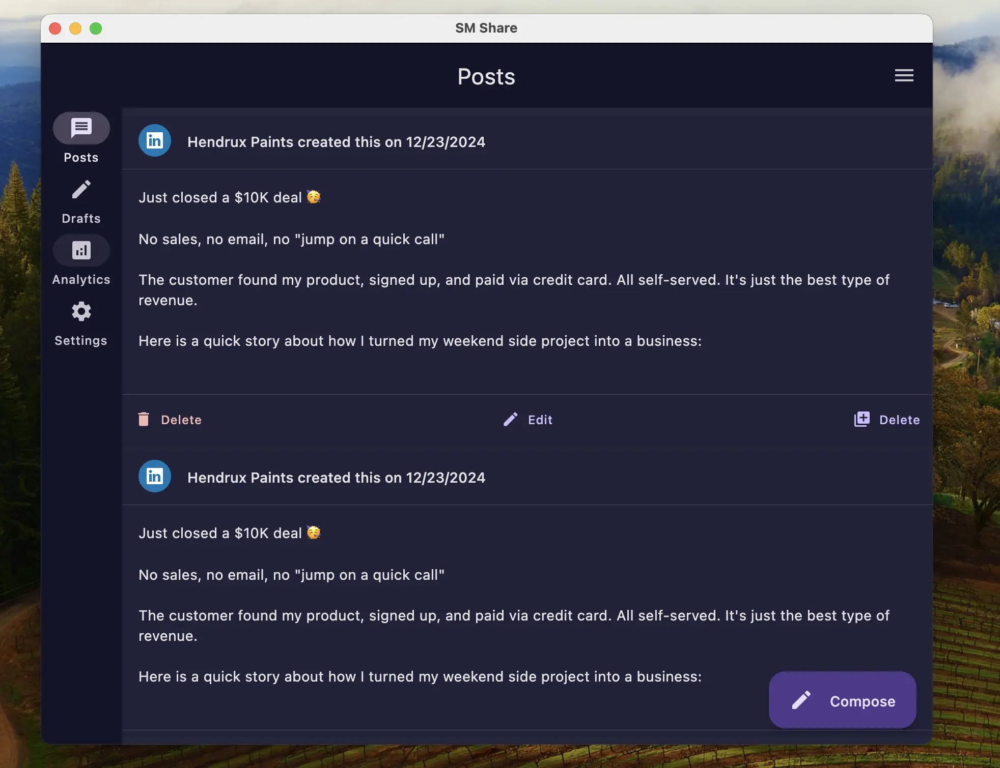
  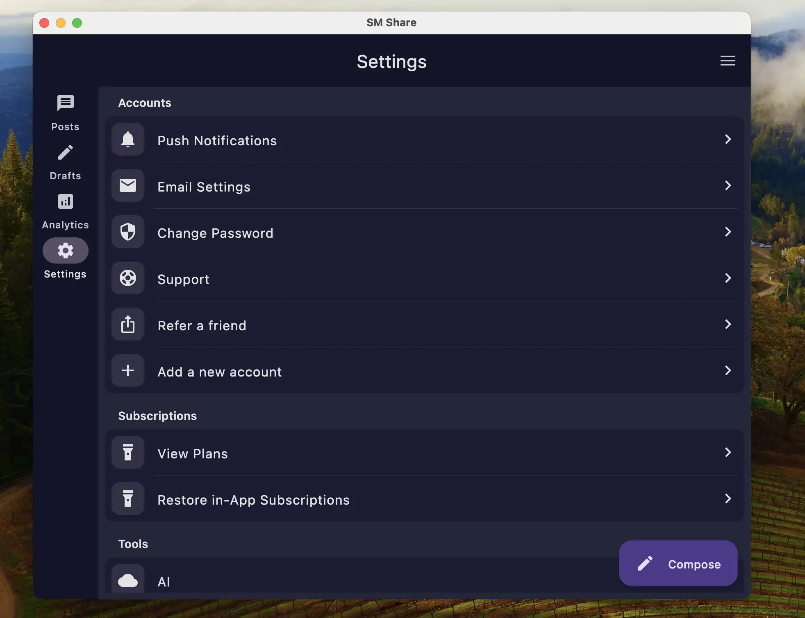
  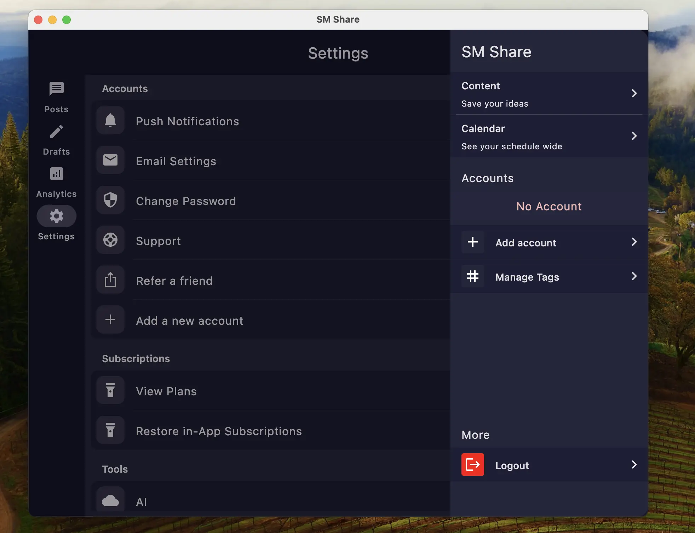
  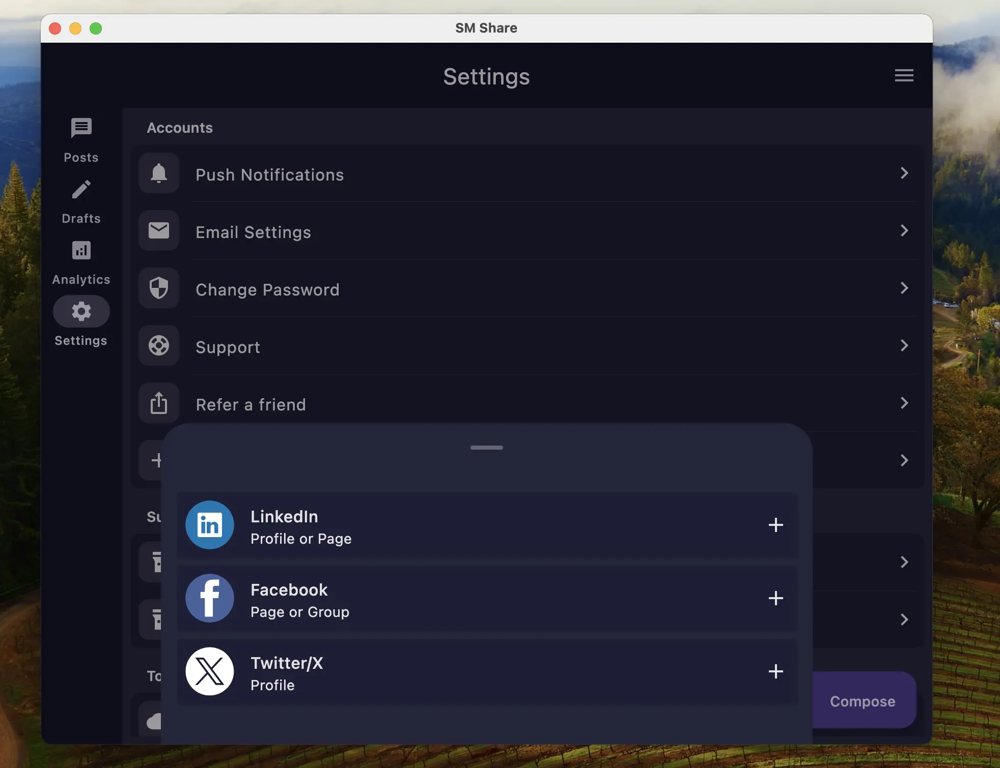
</p>
</details>

## Building

You will require the following rools to build and run SMSahre

- Android SAndroid Studio Jellyfish | 2023.3.1 or higher
- Java 17 installed
- Xcode Version > 15.4

<details>
<summary>Android</summary>

#### Using Android Studio

Open the KMP project using Android Studio, select the `composeApp` run configuration and click on
run.

#### Using Fleet

Fleet uses Smart Mode to detect and configure the Android run configuration for you.You can modify
in the [Run Json file](.fleet/run.json)

#### Using Command line

To run the Android app, use the command below or select the `composeApp` configuration on Android
Studio and click on run.

</details>

<details>
  <summary>Desktop</summary>

#### Using Fleet

Fleet uses Smart Mode to detect and configure the Android run configuration for you.You can modify
in the [Run Json file](.fleet/run.json)

#### Using Command line

```bash
./gradlew desktopRun -DmainClass=com.jerryokafor.smshare.MainKt --quiet
```

 </details>

<details>
  <summary>iOS</summary>

#### Using XCode

Open `iosApp/iosApp.xcworkspace` from Xcode and run.
Note: You need to have run `pod install` from the `iOSApp` directory app

#### Using Fleet

Fleet uses Smart mode to configure iOS run configuration for you. You can modify in
the [Run Json file](.fleet/run.json)
 </details>

<details>
  <summary>Server</summary>

#### Using Fleet

Fleet uses Smart mode to detect and configure the various run configurations for you for iOS,
Android, Desktop and Server. Ensure the You have Xcode, Android Studio, iOS Simulator, Android
Emulator all installed or Physical iphone and Android Devices plugged in.

#### From Command Line

To run the server code, you can run the gradle command below:

```bash
./gradlew :server:run
```

Open: `http://0.0.0.0:8080/` or `http://localhost:8080/`  to see the response from the server.

To access server from your Android device, run `adb reverse tcp:8080 tcp:8080` and then access the
app on `http://<PC IP>:8080/`

##### Using Docker

```bash
./gradlew buildImage
```

##### Load image into docker

```bash
docker load < build/jib-image.tar
```

#### Testing Locally from your phone, run the following command:

##### Android

Ensure yuor android phone is connected and adb is running, then run

```bash
adb reverse tcp:8080 tcp:8080
```

Then open `http://localhost:8080` from your android phone to test. You can now also use this in the
base url of
your api requests for Android.

#### iOS

For iOS, you can follow this
guide : [How to open a localhost website on iPhone / iOS](https://maxschmitt.me/posts/localhost-iphone-ios)
 </details>

## UI Testing

### Android Emulator test

```bash
./gradlew :composeApp:connectedAndroidTest
```

### iOS Simulator

```bash
./gradlew :composeApp:iosSimulatorArm64Test
```

### Desktop

```bash
./gradlew :composeApp:desktopTest
```

### Wasm (headless browser)

```bash
./gradlew :composeApp:wasmJsTest
```

## Code Style (Todo)

### Code Quality

#### Ensure Code Quality before submitting PR

```bash
./gradlew detekt ktlintCheck 
```

#### Generate Detekt baseline

```bash
./gradlew detektProjectBaseline  
```

#### Generate Ktlint Baseline

```bash
ktlint -F --baseline=config/ktlint/baseline.xml
```

or Using Gradle command

```bash
./gradlew ktlintFormatBaseline
```

## Todo

- [X] Add KtLint and Detekt
- [X] Add Detekt
- [X] Add Kover
- [X] Add Codecov
- [ ] Add Code style to readme
- [ ] Add Contributors section
- [ ] Add License section
- [X] Add Room KMP database
- [X] Add Datastore

## Reference

- [Testing Compose Multiplatform UI](https://www.jetbrains.com/help/kotlin-multiplatform-dev/compose-test.html#d1be12e6)
- [Jetpack Room KMP](https://johnoreilly.dev/posts/jetpack_room_kmp/)
- [Advanced work with the Snackbar in the Jetpack Compose](https://proandroiddev.com/advanced-work-with-the-snackbar-in-the-jetpack-compose-9bb7b7a30d60)
- [FantasyPremierLeague](https://github.com/joreilly/FantasyPremierLeague/tree/main)
- [Tivi](https://github.com/chrisbanes/tivi)
- [Compose Custom Window frame](https://github.com/amir1376/compose-custom-window-frame)
- [Targeting Android in KMP](https://medium.com/kodein-koders/targeting-android-in-a-kotlin-multiplatform-mobile-library-b6ab75469287)
- [Understanding and Configuring your Kotlin Multiplatform Mobile Test Suite](https://touchlab.co/understanding-and-configuring-your-kmm-test-suite)
- [KMM-PicSplash](https://github.com/cvivek07/KMM-PicSplash)
- [Native distributions & local execution](https://github.com/JetBrains/compose-multiplatform/tree/master/tutorials/Native_distributions_and_local_execution)
- [GitHub Actions: Firebase Test Lab](https://medium.com/firebase-developers/github-actions-firebase-test-lab-4bc830685a99)
- https://www.marcogomiero.com/posts/2022/ktor-migration-liquibase/

## Contributions

If you've found an error in this sample, please file an issue.

Patches are encouraged and may be submitted by forking this project and
submitting a pull request.Since this project is still in its very early stages,
if your change is substantial, please raise an issue first to discuss it.

## License

```
The MIT License (MIT)

Copyright (c) 2024 SMShare Projects

Permission is hereby granted, free of charge, to any person obtaining a copy of this software and associated documentation files (the "Software"), to deal in the Software without restriction, including without limitation the rights to use, copy, modify, merge, publish, distribute, sublicense, and/or sell copies of the Software, and to permit persons to whom the Software is furnished to do so, subject to the following conditions:

The above copyright notice and this permission notice shall be included in all copies or substantial portions of the Software.

THE SOFTWARE IS PROVIDED "AS IS", WITHOUT WARRANTY OF ANY KIND, EXPRESS OR IMPLIED, INCLUDING BUT NOT LIMITED TO THE WARRANTIES OF MERCHANTABILITY, FITNESS FOR A PARTICULAR PURPOSE AND NONINFRINGEMENT. IN NO EVENT SHALL THE AUTHORS OR COPYRIGHT HOLDERS BE LIABLE FOR ANY CLAIM, DAMAGES OR OTHER LIABILITY, WHETHER IN AN ACTION OF CONTRACT, TORT OR OTHERWISE, ARISING FROM, OUT OF OR IN CONNECTION WITH THE SOFTWARE OR THE USE OR OTHER DEALINGS IN THE SOFTWARE.
```
